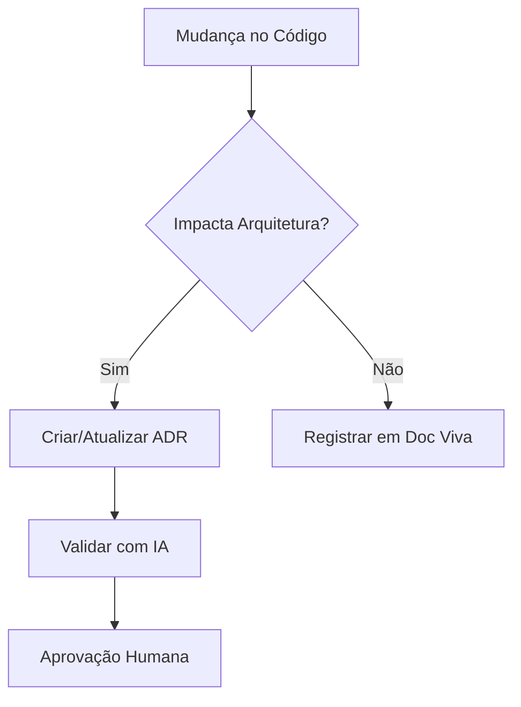

<!-- TEMPLATE: adr-template-v2.md -->

# ADR-001: Manutenção de Documentação Viva com IA

## Status
✅ Proposto  
⬜ Implementado  
⬜ Obsoleto

## Autores
- [Seu Nome] (Responsável Principal)
- Cline (Agente de IA Assistente)

## Contexto
Necessidade de manter a documentação técnica atualizada durante o desenvolvimento, integrando:
1. Decisões arquiteturais
2. Mudanças no código
3. Evolução dos requisitos
4. Feedback da IA

## Decisão
Adotar um processo colaborativo onde:
- ADRs são criados e mantidos durante o desenvolvimento
- A IA auxilia na documentação e rastreabilidade
- Revisões periódicas garantem atualização

## Alternativas Consideradas
1. **Documentação estática tradicional**
   - Prós: Simplicidade inicial
   - Contras: Dificuldade de manutenção

2. **Ferramentas externas de documentação**
   - Prós: Recursos avançados
   - Contras: Custo e curva de aprendizado

## Impactos
- ✅ Melhoria na rastreabilidade de decisões
- ✅ Atualização automática da documentação
- ⚠️ Esforço adicional inicial para configuração

## Descrição
Este documento define o padrão para manutenção de documentação viva integrada com IA, garantindo que decisões arquiteturais sejam devidamente registradas e mantidas atualizadas.

## Exemplos
```markdown
# Exemplo de ADR
## Contexto
[Descrição do contexto técnico]

## Decisão
[Detalhes da decisão arquitetural]

## Impactos
[Lista de impactos esperados]
```

## Uso
1. Criar novo ADR usando o template
2. Atualizar conforme mudanças ocorrem
3. Revisar periodicamente com a equipe

## Integração com IA
- Geração automática de trechos de documentação
- Validação de consistência
- Sugestões de melhoria contínua

## Fluxo de Trabalho


## Registro de Mudanças
| Data       | Versão | Alteração               |
|------------|--------|-------------------------|
| 2025-05-20 | 1.0    | Criação do documento    |
| 2025-05-20 | 1.1    | Adequação ao novo padrão |
