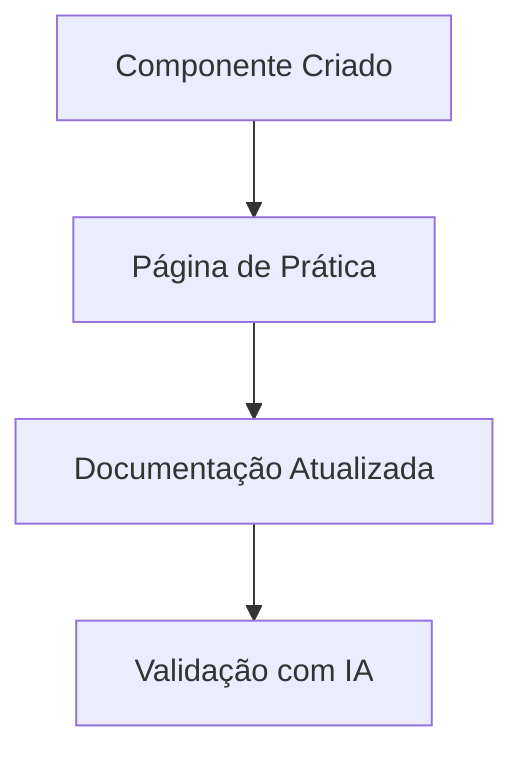

# Atualizações de Integração com IA

## Implementação do Componente PronunciationFeedback

**Data:** 21/05/2025  
**Responsável:** Cline (Agente de IA)

### Mudanças Implementadas:
1. Criação do componente `PronunciationFeedback`
   - Integração com Whisper API
   - Captura e análise de áudio
   - Feedback de pronúncia

2. Página de prática
   - Lista de frases para treino
   - Navegação entre frases
   - Integração com o componente

### Impacto na Documentação:
- Atualização automática via script `update-living-docs.js`
- Registro no CHANGELOG.md
- Documentação técnica atualizada

### Próximos Passos:
- [ ] Testes de integração
- [ ] Documentação de casos de uso
- [ ] Exemplos avançados

| Data       | Versão | Alteração               | Autor     |
|------------|--------|-------------------------|-----------|
| 2025-05-21 | 1.0    | Criação do documento    | Cline     |
