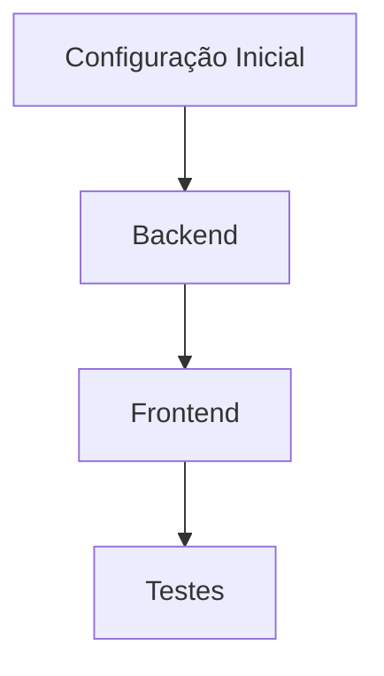

# Plano de Implementação de Autenticação - CEIAL Learn English

<!-- VERSION: 1.0.0 -->
<!-- LAST_UPDATE: 2025-05-18 -->

## Visão Geral
Implementação de autenticação segura usando:
- Auth.js v5+
- MongoDB
- Credentials Provider
- JWT

## Estado Atual
✅ Plano aprovado  
⬜ Configuração inicial

## Checkpoints

### Fase 1: Configuração Inicial
1. [ ] Instalar dependências
2. [ ] Configurar conexão com MongoDB
3. [ ] Criar arquivo de configuração do Auth.js

### Fase 2: Backend
1. [ ] Implementar CredentialsProvider
2. [ ] Criar rotas de autenticação
3. [ ] Middleware de proteção

### Fase 3: Frontend
1. [ ] Páginas de login/cadastro
2. [ ] Contexto de autenticação
3. [ ] Proteção de rotas

### Fase 4: Testes
1. [ ] Testes unitários
2. [ ] Testes de integração
3. [ ] Testes E2E

## Como Continuar
Se necessário reiniciar a task:
1. Verificar commits recentes
2. Consultar este arquivo
3. Executar `npm run test:auth` (a ser criado)

## Dependências Críticas
- MongoDB rodando em ${MONGODB_URI}
- Variáveis de ambiente configuradas
