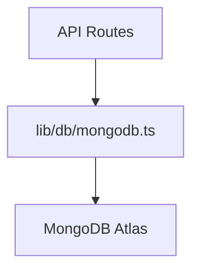

# MongoDB Connection Setup

## Architecture


## Usage
```typescript
import clientPromise from '@/lib/db/mongodb'

const client = await clientPromise
const db = client.db('databaseName')
```

## Health Check
Endpoint: `GET /api/health/mongodb`
Response:
```json
{
  "status": "healthy" | "error",
  "message": "string"
}
