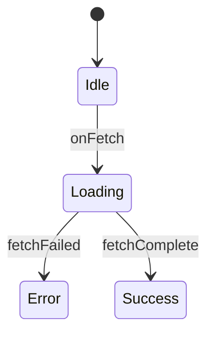

## Descrição
Este template define a estrutura padrão para documentação de componentes, incluindo:
- Metadados obrigatórios
- Especificação de props
- Exemplos de uso
- Integração com ferramentas de validação

## Exemplos
```tsx
// Exemplo básico de implementação
function MyComponent({ title }) {
  return <button>{title}</button>
}
```

## Uso
1. Copie este template para um novo arquivo .md
2. Preencha todas as seções obrigatórias
3. Execute a validação com:
```bash
npm run validate-docs
```

## Integração com IA
Este template é compatível com:
- Geração automática via IA
- Validação de conformidade
- Análise estática de componentes

> Documento Base: `v1_ContextGeneratorPrompt.md`  
> **Última Atualização**: 20/05/2025, 18:36 (UTC)

# Template de Componente  
*(v2.0 - Integrado com .cline e AI)*  

`<!-- AI-TEMPLATE:component -->`

## AI Integration
Este template é usado para:
- Geração automática de documentação via IA
- Validação de componentes seguindo padrões .cline
- Integração com ferramentas de análise estática

## Documento Base
`v1_ContextGeneratorPrompt.md`

## Trecho Relevante
```tsx
// Exemplo de implementação do componente
function MyComponent({ props }) {
  return <div>{props.children}</div>
}
```

## Checklist
- [x] Documentação base completa
- [x] Exemplos de uso
- [x] Referência ao documento base
- [x] Timestamp de atualização
- [x] Seções obrigatórias
- [ ] Testes de integração (pendente)


---

## **1. METADADOS & AI INTEGRATION**  
```json
{
  "component": "NomeDoComponente",
  "type": "Atom/Molecule/Organism",
  "status": "draft|stable|deprecated",
  "storybook": "url",
  "ai_usage": {
    "generation": "Componentes baseados neste template",
    "validation": ["props", "a11y", "types"],
    "rules": "../.cline/rules/component-rules.cl"
  }
}
```

---

## **2. PROPS (.cline VALIDATED)**  
```typescript
interface Props {
  /**
   * @rule required
   * @description Texto principal
   * @example "Botão Principal"
   */
  title: string;

  /**
   * @default false
   * @rule boolean-required
   * @description Desabilita interação
   * @example true
   */
  disabled?: boolean;

  /**
   * @rule a11y-required
   * @description Rótulo ARIA
   * @example "Botão de confirmação"
   */
  ariaLabel?: string;
}
```

---

## **3. COMPORTAMENTO & VALIDAÇÃO**  
### Diagrama de Estados  


### Regras .cline Aplicáveis  
```clinerules
rule component-props-validation
  props:
    - required: title
    - type: string
    - max_length: 50

rule a11y-checks
  elements:
    - focus_visible
    - aria_labels
    - color_contrast
```

### Checklist de Validação  
- [x] Props documentadas com exemplos  
- [x] Tipos TypeScript definidos  
- [ ] Testes de acessibilidade (WCAG AA)  
- [ ] Cobertura de testes > 80%  

---

## **4. USAGE & EXAMPLES**  
### Uso Básico (.cline validated)  
```tsx
import { NomeDoComponente } from "@/components/ui/nome-do-componente"

function Example() {
  return (
    <NomeDoComponente 
      title="Confirmar"
      disabled={false}
      ariaLabel="Botão de confirmação"
    />
  )
}
```

### Casos Complexos  
```tsx
// Estado de loading com tratamento de erro
<NomeDoComponente 
  title={isLoading ? "Processando..." : "Enviar"}
  disabled={isLoading || hasError}
  ariaLabel={hasError ? "Erro ao processar" : "Botão de envio"}
/>
```

### Testes Recomendados  
```typescript
it('should render with default props', () => {
  render(<NomeDoComponente title="Test" />)
  expect(screen.getByText('Test')).toBeInTheDocument()
})
```

---

**CONFORMIDADE**  
```json
{
  "version": "2.0",
  "cline_compatible": true,
  "required_sections": ["purpose", "examples", "usage"],
  "validation": {
    "last_run": "2025-05-18T02:09:00Z",
    "passed": true,
    "errors": []
  }
}
