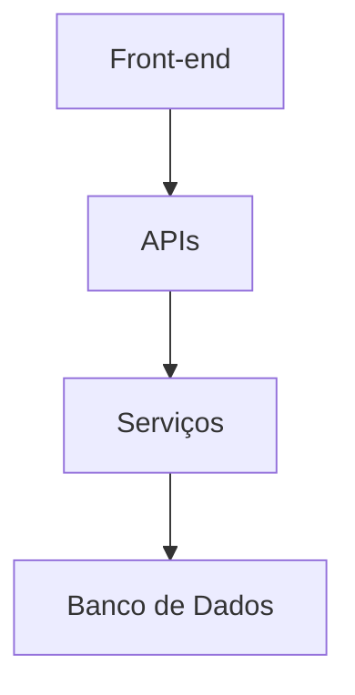
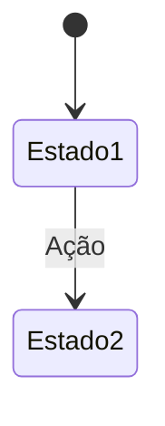
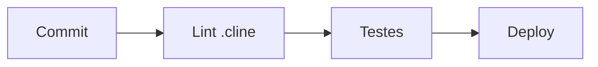

# Template Principal do Projeto  
*(v2.0 - Integrado com .cline e AI)*  
<!-- AI-TEMPLATE:project-context -->  

`<!-- CLINE-RULES:project-master -->`

---

## **1. VISÃO & AI INTEGRATION**  
```json
{
  "ai_usage": {
    "context": "Este template gera documentação de projetos",
    "validation": ["architecture", "flows", "tech_stack"],
    "rules": "../.cline/rules/project-rules.cl"
  }
}

### Objetivo Principal  
<!-- Descreva em 1-2 parágrafos o propósito central do projeto -->  
[Descrição concisa do propósito do projeto]  

**Exemplo (.cline validated):**  
```text
"Desenvolver uma plataforma de aprendizado de inglês com feedback em tempo real usando IA para:
- Avaliação de pronúncia
- Correção gramatical
- Sugestões de vocabulário
- Análise de fluência
- Melhoria contínua
- Personalização de conteúdo"
```

### Público-Alvo  
<!-- Liste personas principais e necessidades específicas -->  
- [Persona 1]: [Necessidades específicas]  
- [Persona 2]: [Casos de uso]  

### Diferenciais Competitivos  
<!-- Máximo 3 diferenciais principais -->  
1. [Diferencial 1]  
2. [Diferencial 2]  

---

## **2. ARQUITETURA TÉCNICA**  

<!-- Atualize o diagrama conforme sua stack -->  

### Stack Tecnológica (.cline validated)  
| Camada         | Tecnologias               | Versão   | Justificativa              | Regras Aplicadas          |
|----------------|---------------------------|----------|----------------------------|---------------------------|
| Front-end      | Next.js/React             | 15.3.2   | SSR, Rota API integrada    | next-version-rule         |
| Back-end       | Node.js/API Routes        | 20.x     | Compatibilidade com Vercel | node-version-rule         |
| IA             | OpenAI Whisper            | 4.100.0  | Transcrição precisa        | api-key-rotation-rule     |

**Exemplo de Validação:**  
```clinerules
rule next-version-rule
  min_version: "15.0.0"
  max_version: "16.0.0"
```

---

## **3. FLUXOS CRÍTICOS**  
### Fluxo Principal  

<!-- Descreva os estados principais do sistema -->  

### Modelo de Dados Principal  
```json
{
  "entidade": {
    "campo": "tipo",
    "relacionamentos": []
  }
}
```

---

## **4. PADRÕES & VALIDAÇÃO**  
### Componentes React (.cline rules)  
```typescript
/**
 * @rule component-props-validation
 * @example <Button primary />
 */
interface ComponentProps {
  /** 
   * @description Texto principal 
   * @rule required
   * @example "Enviar"
   */
  title: string;
  
  /** 
   * @default false 
   * @rule boolean-required
   */
  disabled?: boolean;
}
```

### Validação Contínua  


### APIs REST  
```yaml
paths:
  /api/endpoint:
    get:
      parameters:
        - name: param
          in: query
          required: true
```

---

## **5. GOVERNANÇA**  
### Ciclo de Vida do Documento  
<!-- Checklist de gatilhos para atualização -->  
- [ ] Novo módulo adicionado  
- [ ] Mudança de arquitetura  
- [ ] Atualização de tecnologias principais  

### Responsáveis  
| Área          | Owner           |
|---------------|-----------------|
| Front-end     | [@dev1]         |
| Back-end      | [@dev2]         |

---

**CONFORMIDADE**  
```json
{
  "version": "2.0",
  "cline_compatible": true,
  "required_sections": ["vision", "architecture", "standards"],
  "validation": {
    "last_run": "2025-05-18T02:11:00Z",
    "passed": true,
    "warnings": [
      "Atualizar exemplos de fluxos"
    ]
  }
}
```
