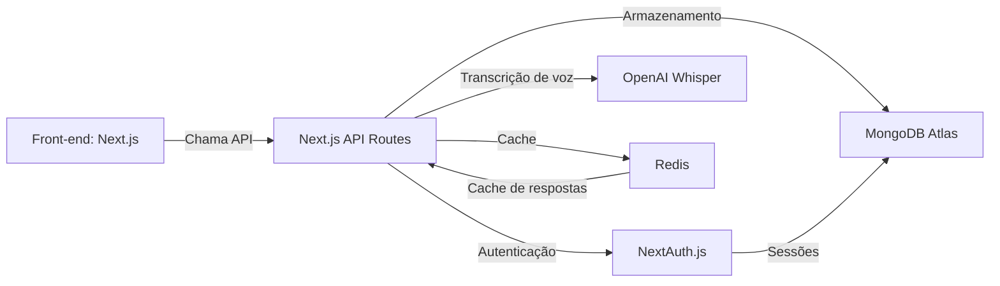
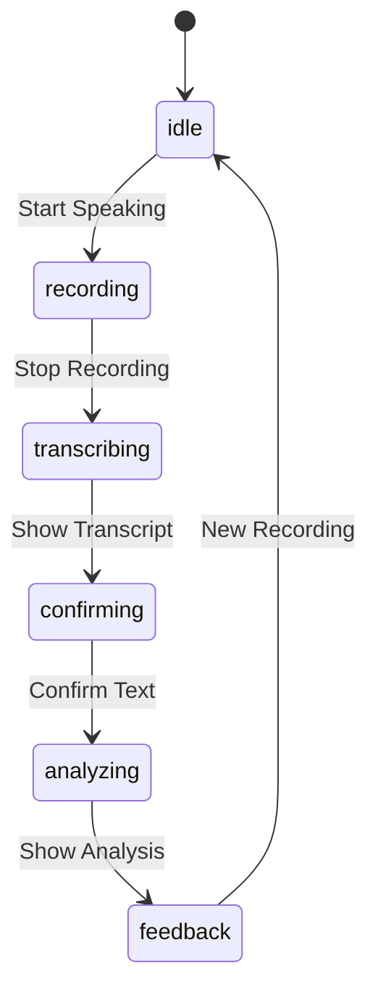

# **Documento de Contexto do Projeto: English Voice Coach**  
*(Para uso em consultas com IA, desenvolvimento e tomada de decisões)*  

---

## **1. Visão Geral**  
**Nome do Projeto**: English Voice Coach  
**Objetivo**:  
Desenvolver uma aplicação web interativa para prática de conversação em inglês, utilizando IA para fornecer feedback em tempo real sobre:  
- Pronúncia  
- Gramática  
- Naturalidade (expressões comuns de nativos americanos)  

**Público-Alvo**:  
- Estudantes de inglês (níveis A2 a B2)  
- Profissionais que precisam melhorar a fluência para negócios  

**Diferenciais**:  
- Feedback instantâneo com explicações claras  
- Exercícios baseados em erros recorrentes do usuário  
- Comparação com áudios de falantes nativos  

---

## **2. Arquitetura Técnica**  
### **Diagrama de Componentes**  


### **Tecnologias**  
| Componente          | Tecnologia/Serviço       | Descrição                              |
|---------------------|--------------------------|----------------------------------------|
| **Front-end**       | Next.js 15.3.2, Tailwind CSS | Interface responsiva com captura de voz |
| **Back-end**        | Next.js API Routes       | Lógica de negócios e integrações       |
| **Autenticação**    | NextAuth.js              | Gerenciamento de usuários e sessões       |
| **Transcrição**     | OpenAI Whisper           | Conversão de áudio para texto          |
| **Banco de Dados**  | MongoDB Atlas            | Progresso do usuário e histórico       |
| **Cache**           | Redis                    | Armazenamento temporário de respostas  |

---

## **3. Fluxos Principais**  
### **Fluxo de Conversação**  
1. Usuário inicia gravação (estado: recording)  
2. Sistema captura áudio via Web Speech API  
3. Áudio é enviado para OpenAI Whisper (estado: transcribing)  
4. Usuário confirma texto transcrito (estado: confirming)  
5. Texto confirmado é analisado (estado: analyzing):  
   - Pronúncia (pontuação 0-100)  
   - Gramática  
   - Erros comuns  
   - Feedback gerado no idioma selecionado  
6. Sistema exibe feedback detalhado (estado: feedback)  
7. Dados são salvos incluindo:  
   - Texto original (sempre em inglês)  
   - Texto corrigido (quando aplicável)  
   - Pontuações de pronúncia/gramática  
   - Erros identificados  
   - Idioma do feedback  
8. Usuário pode reiniciar o fluxo (estado: idle)  



### **Fluxo de Progresso**  
1. Usuário acessa dashboard "My Progress"  
2. Sistema busca sessões recentes no MongoDB  
3. Calcula métricas agregadas:  
   - Total de sessões  
   - Médias de pronúncia/gramática  
   - Erros mais frequentes  
4. Exibe dados em gráficos e listas  

**Exemplo de Saída da IA (JSON):**  
```json
{
  "userInput": "I think the cat is on the mat",
  "correction": "I think the cat is on the mat",
  "feedback": {
    "grammar": "Sentence is grammatically correct",
    "pronunciation": [
      "Practice 'th' sound in 'think' (θ)",
      "Shorten vowel in 'cat' (æ vs ɑː)"
    ],
    "fluency": "Speak more slowly (audio duration too short)"
  },
  "pronunciationScore": 72,
  "grammarScore": 95,
  "commonMistakes": ["th_sound", "vowel_length"],
  "suggestions": [
    "Practice minimal pairs: think/sink, cat/cut",
    "Record yourself and compare with native speakers"
  ],
  "feedbackLanguage": "en", // ou "pt" conforme seleção do usuário
  "audioAnalysis": {
    "durationRatio": 0.65,
    "pauses": 2,
    "pitchVariation": 0.8
  }
}
```

**Parâmetros da API:**
```json
{
  "audio": "base64_encoded_audio",
  "response_language": "pt" // ou "en" (define o idioma do feedback, padrão: "en")
}
```

---

## **4. Requisitos Funcionais**  
| ID   | Descrição                                                                 | Prioridade |
|------|---------------------------------------------------------------------------|------------|
| RF01 | Captura de voz via navegador com Web Speech API                          | Alta       |
| RF02 | Sistema de autenticação seguro com NextAuth.js                          | Alta       |
| RF03 | Sistema avançado de pontuação de pronúncia (0-100) com análise de duração do áudio e detecção de erros comuns | Alta       |
| RF04 | Dashboard de progresso com métricas (erros recorrentes, evolução)        | Alta       |
| RF05 | Armazenamento automático de sessões de prática                           | Alta       |
| RF06 | Cálculo de métricas agregadas (média de pronúncia/gramática)             | Alta       |
| RF07 | Sistema de coleta e análise de feedback dos usuários (sugestões, bugs)    | Média      |
| RF08 | Painel administrativo para gestão de feedbacks recebidos                  | Média      |

---

## **5. Requisitos Não-Funcionais**  
| ID   | Descrição                                  | Métrica Aceitável               |
|------|--------------------------------------------|----------------------------------|
| RNF01| Tempo de resposta da IA                   | < 2 segundos                    |
| RNF02| Suporte a usuários simultâneos            | 1,000+                          |
| RNF03| Precisão na detecção de erros gramaticais | ≥ 85% (vs. avaliação humana)    |
| RNF04| Otimização de custos com APIs pagas       | Redução mínima de 30% no uso    |

---

## **6. Dependências Externas**  
| Serviço                | Uso no Projeto                              | Plano (Free/Pago) |
|------------------------|---------------------------------------------|-------------------|
| OpenAI Whisper         | Transcrição de áudio                        | Pay-as-you-go     |
| **Estratégias de Otimização**: 
   - Cache Redis para todas as respostas API (TTL 1h)
   - Autenticação stateless com JWT para reduzir carga no DB
   - Rate limiting nas APIs sensíveis (login, voice)
   - Compressão de áudio antes do envio para Whisper
   - Monitoramento via endpoint `/api/cache-metrics` |
| MongoDB Atlas          | Armazenamento de dados do usuário e progresso | Free Tier (512MB) |
| Redis (futuro)         | Cache de respostas da API                   | Free Tier (30MB)  |

---

## **7. Exemplos de Consultas para IA**  
*(Baseadas neste contexto)*  

### **Para Geração de Código**  
*"Usando Next.js 15, crie um endpoint de API que:  
- Recebe áudio (sempre transcrito em inglês)  
- Aceita parâmetro response_language (opcional, padrão 'en')  
- Realiza análise mantendo o texto original  
- Retorna feedback no idioma solicitado  
- Inclui pontuações e sugestões específicas"*

### **Para Melhorias**  
*"Sugira 5 métricas adicionais para avaliar a eficácia do feedback de pronúncia, considerando a arquitetura atual."*  

### **Para Documentação**  
*"Gere um README.md para este projeto, incluindo instruções de deploy na Vercel e configuração das APIs."*  

---

## **8. Como Atualizar Este Documento**  
1. **Revisão Mensal**: Use IA para verificar inconsistências com o código atual.  
   - *Prompt*: "Compare o arquivo X no repositório com a seção Y deste documento. Há diferenças?"  
2. **Atualizações de Requisitos**:  
   - Adicione novas funcionalidades na seção **4** e peça à IA para reavaliar prioridades.  
3. **Integrações com Ferramentas**:  
   - Vincule este documento a issues do GitHub (ex.: *"Fix #123: atualizar fluxo de transcrição"*).  

---

## 9. Implementações Recentes

### Configuração do Redis
Consulte `configuration-guide.md` para detalhes completos da configuração do Redis, incluindo:
- Imagem Docker recomendada
- Configuração de portas
- Health checks automáticos
- Persistência de dados

### Sistema de Cache Avançado
- Métricas detalhadas por tipo de operação:
  - Geral (hits/misses)
  - Transcrição de voz (transcription:hits/misses)
  - Análise de texto (analysis:hits/misses)
- TTL diferenciado por tipo de cache:
  ```typescript
  currentTTL: {
    default: 3600, // 1 hora
    transcription: 3600,
    analysis: 3600
  }
  ```
- Conexão Redis com tratamento de erros:
  ```typescript
  const redis = createClient({
    url: process.env.REDIS_URL || 'redis://localhost:6379'
  })
  redis.on('error', (err) => console.error('Redis Client Error', err))
  ```

### Endpoint de Métricas (/api/cache-metrics)
Retorna JSON com:
- Contagens absolutas de hits/misses
- Taxas de acerto (hit rate) geral e por tipo
- TTLs configurados atualmente

**Exemplo de Resposta:**
```json
{
  "hits": 142,
  "misses": 38,
  "transcriptionHits": 85,
  "transcriptionMisses": 12,
  "analysisHits": 57,
  "analysisMisses": 26,
  "overallHitRate": "78.89%",
  "transcriptionHitRate": "87.63%",
  "analysisHitRate": "68.67%",
  "currentTTL": {
    "default": 3600,
    "transcription": 3600,
    "analysis": 3600
  }
}
```

### Sistema de Feedback Administrativo (/api/admin/feedback)
**Funcionalidades:**
- Listagem de feedbacks com lookup de usuários
- Fallback para usuários não encontrados (mostra ID parcial)
- Filtros por tipo (suggestion|bug|compliment) e status
- Ordenação por data de criação

**Exemplo de Resposta:**
```json
{
  "feedbacks": [
    {
      "id": "65d3a8b7e4b3d6f5a2c7e1f2",
      "userId": "65d3a8b7e4b3d6f5a2c7e1f3",
      "userEmail": "user@example.com",
      "userName": "John Doe",
      "type": "suggestion",
      "status": "open",
      "message": "Add more pronunciation exercises",
      "createdAt": "2025-05-08T02:46:00Z"
    }
  ]
}
```

**Nota**: Este documento deve ser armazenado no repositório do projeto (ex.: `/docs/v1_ContextGeneratorPrompt.md`) e referenciado em todas as consultas à IA para manter consistência.

## **10. Considerações Finais**
- Este documento é um ponto de partida e deve ser atualizado conforme o projeto evolui.
- Utilize sempre a IA para validar e sugerir melhorias, mas mantenha o controle humano sobre decisões críticas.
- A colaboração entre desenvolvedores e IA é essencial para o sucesso do projeto.
